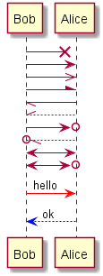
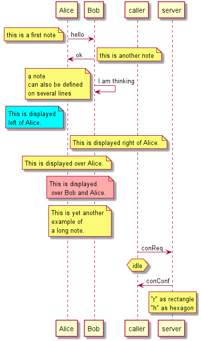
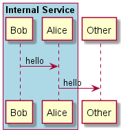
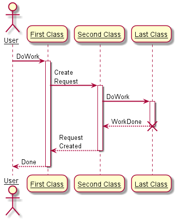
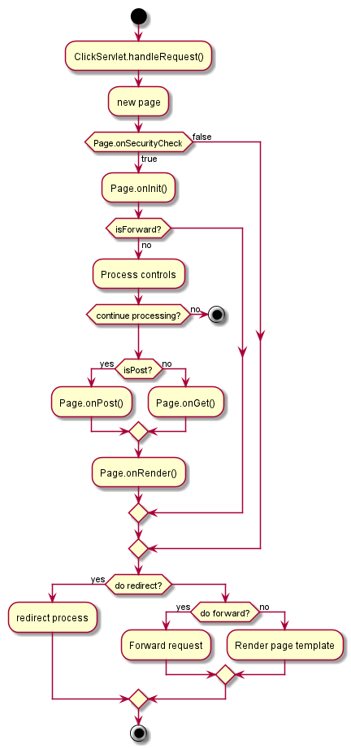
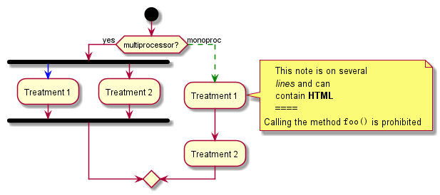
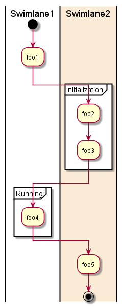

# plantuml

http://plantuml.com

## 时序图

```
@startuml
Alice -> Bob: Authentication Request
Bob --> Alice: Authentication Response

Alice -> Bob: Another authentication Request
Alice <-- Bob: another authentication Response
@enduml
```


```
@startuml
actor Foo1
boundary Foo2
control Foo3
entity Foo4
database Foo5
collections Foo6
Foo1 -> Foo2 : To boundary
Foo1 -> Foo3 : To control
Foo1 -> Foo4 : To entity
Foo1 -> Foo5 : To database
Foo1 -> Foo6 : To collections

@enduml
```


```
@startuml
actor Bob #red
' The only difference between actor
'and participant is the drawing
participant Alice
participant "I have a really\nlong name" as L #99FF99
/' You can also declare:
   participant L as "I have a really\nlong name"  #99FF99
  '/

Alice->Bob: Authentication Request
Bob->Alice: Authentication Response
Bob->L: Log transaction
@enduml
```


```
@startuml
Bob ->x Alice
Bob -> Alice
Bob ->> Alice
Bob -\ Alice
Bob \\- Alice
Bob //-- Alice

Bob ->o Alice
Bob o\\-- Alice

Bob <-> Alice
Bob <->o Alice

Bob -[#red]> Alice : hello
Alice -[#0000FF]->Bob : ok
@enduml
```



```
@startuml
autonumber 10 10 "<b>[000]"
Bob -> Alice : Authentication Request
Bob <- Alice : Authentication Response

autonumber stop
Bob -> Alice : dummy

autonumber resume "<font color=red><b>Message 0  "
Bob -> Alice : Yet another authentication Request
Bob <- Alice : Yet another authentication Response

autonumber stop
Bob -> Alice : dummy

autonumber resume 1 "<font color=blue><b>Message 0  "
Bob -> Alice : Yet another authentication Request
Bob <- Alice : Yet another authentication Response
@enduml
```


```
@startuml
Alice -> Bob: Authentication Request

alt successful case

	Bob -> Alice: Authentication Accepted
	
else some kind of failure

	Bob -> Alice: Authentication Failure
	group My own label
		Alice -> Log : Log attack start
	    loop 1000 times
	        Alice -> Bob: DNS Attack
	    end
		Alice -> Log : Log attack end
	end
	
else Another type of failure

   Bob -> Alice: Please repeat
   
end
@enduml
```


```
@startuml
Alice->Bob : hello
note left: this is a first note

Bob->Alice : ok
note right: this is another note

Bob->Bob : I am thinking
note left
	a note
	can also be defined
	on several lines
end note

note left of Alice #aqua
	This is displayed
	left of Alice.
end note

note right of Alice: This is displayed right of Alice.

note over Alice: This is displayed over Alice.

note over Alice, Bob #FFAAAA: This is displayed\n over Bob and Alice.

note over Bob, Alice
	This is yet another
	example of
	a long note.
end note


caller -> server : conReq
hnote over caller : idle
caller <- server : conConf
rnote over server
 "r" as rectangle
 "h" as hexagon
endrnote
@enduml
```



```
@startuml

== Initialization ==

Alice -> Bob: Authentication Request
Bob --> Alice: Authentication Response

== Repetition ==

Alice -> Bob: Another authentication Request
Alice <-- Bob: another authentication Response

@enduml
```


```
@startuml
participant User

User -> A: DoWork
activate A #FFBBBB

A -> B: << createRequest >>
activate B

B -> C: DoWork
activate C
C --> B: WorkDone
destroy C

B --> A: RequestCreated
deactivate B

A -> User: Done
deactivate A

@enduml
```


```
@startuml

box "Internal Service" #LightBlue
	participant Bob
	participant Alice
end box
participant Other

Bob -> Alice : hello
Alice -> Other : hello

@enduml
```



```
@startuml
skinparam sequenceArrowThickness 2
skinparam roundcorner 20
skinparam maxmessagesize 60
skinparam sequenceParticipant underline

actor User
participant "First Class" as A
participant "Second Class" as B
participant "Last Class" as C

User -> A: DoWork
activate A

A -> B: Create Request
activate B

B -> C: DoWork
activate C
C --> B: WorkDone
destroy C

B --> A: Request Created
deactivate B

A --> User: Done
deactivate A

@enduml
```



```
@startuml
skinparam ParticipantPadding 20
skinparam BoxPadding 10

box "Foo1"
participant Alice1
participant Alice2
end box
box "Foo2"
participant Bob1
participant Bob2
end box
Alice1 -> Bob1 : hello
Alice1 -> Out : out
@enduml
```


## 组件图

```

@startuml

package "用户操作" {
  START --> [扫描营业执照/填写企业全称]:业务人员确认营业执照法人
  [扫描营业执照/填写企业全称] --> [按法人姓名扫描身份证]
  [按法人姓名扫描身份证] --> [按股东姓名扫描身份证]
  [按股东姓名扫描身份证] --> [客户填写主要人员信息]
  [客户填写主要人员信息] --> [业务人员填写信息]
  [业务人员填写信息] --> 打印
}

note left of [按股东姓名扫描身份证]
根据云端查询股东姓名、
出资比例，根据业务逻辑
确定股东并扫描身份证
end note

node "后台业务流程" {
  [按法人姓名扫描身份证] ....> [法人身份信息入库]
  [按股东姓名扫描身份证] ....> [股东身份信息入库]
  [客户填写主要人员信息] ....> [财务负责人、经办人信息入库]
  [客户填写主要人员信息] ....> [受益人信息入库]
  [客户填写主要人员信息] ....> [法人身份信息入库]:电话
  [业务人员填写信息] ....> [其他企业信息入库]

  [法人身份信息入库] ....> 身份信息:法人身份信息
  [云端企业信息] ....> 企业信息
  [股东身份信息入库] ....> 身份信息:股东身份信息
  [财务负责人、经办人信息入库] ....> 身份信息:财务负责人、经办人
  [受益人信息入库] ....> 身份信息:受益人
  [其他企业信息入库] ....> 其他企业信息
}

cloud {
  [企业信息供应商]
}


database "Database" {
  frame "身份信息" {
    [人员类型]
	[姓名]
	[证件号码]
	[证件有效期]
	[出生日期]
	[国籍]
    [电话]
  }

  folder "企业信息" {
  	[企业名称]
  	[信用代码]
  	[主体类型]
  	[企业地址]
  	[法人姓名]
  	[成立日期]
  	[信用代码]
  	[登记机关]
    [注册/成立地区]
    [经营范围]
    [股东姓名]
    [出资比例]
  }
  folder "其他企业信息" {
    [行业类型]
    [客户类型]
    [销售额]
    [机构类别]
    [居民身份]
    [开户目的]
    [经营国家]
    [企业规模]
    [营业国家]
    [反洗钱确认项目]
  }
}


[扫描营业执照/填写企业全称] ..> [企业信息供应商]:提供企业全称
[企业信息供应商] ..> [云端企业信息]
[企业信息供应商] ..> [按法人姓名扫描身份证]:法人姓名
[企业信息供应商] ..> [按股东姓名扫描身份证]:股东姓名

[对接前台系统] <-- Database:直接供数
@enduml
```


## 活动图

```
@startuml

start
:ClickServlet.handleRequest();
:new page;
if (Page.onSecurityCheck) then (true)
  :Page.onInit();
  if (isForward?) then (no)
	:Process controls;
	if (continue processing?) then (no)
	  stop
	endif
	
	if (isPost?) then (yes)
	  :Page.onPost();
	else (no)
	  :Page.onGet();
	endif
	:Page.onRender();
  endif
else (false)
endif

if (do redirect?) then (yes)
  :redirect process;
else
  if (do forward?) then (yes)
	:Forward request;
  else (no)
	:Render page template;
  endif
endif

stop

@enduml
```



```
@startuml

start

if (multiprocessor?) then (yes)
  fork
    -[#blue]->
	:Treatment 1;

  fork again

	:Treatment 2;
  end fork
else (monoproc)
  -[#green,dashed]->
  :Treatment 1;
  note right
    This note is on several
    //lines// and can
    contain <b>HTML</b>
    ====
    * Calling the method ""foo()"" is prohibited
  end note
  :Treatment 2;
endif

@enduml
```



```
@startuml
|Swimlane1|
start
:foo1;
|#AntiqueWhite|Swimlane2|
partition Initialization {
  :foo2;
  :foo3;
}
|Swimlane1|
partition Running {
  :foo4;
}
|Swimlane2|
:foo5;
stop
@enduml
```



```
@startuml
 :start;
 fork
   :foo1;
   :foo2;
 fork again
   :foo3;
   detach
 endfork
 if (foo4) then
   :foo5;
   detach
 endif
 :foo6;
 detach
 :foo7;
 stop
@enduml
```


```
@startuml
:Ready;
:next(o)|
:Receiving;
split
 :nak(i)<
 :ack(o)>
split again
 :ack(i)<
 :next(o)
 on several line|
 :i := i + 1]
 :ack(o)>
split again
 :err(i)<
 :nak(o)>
split again
 :foo/
split again
 :i > 5}
stop
end split
:finish;
@enduml
```

